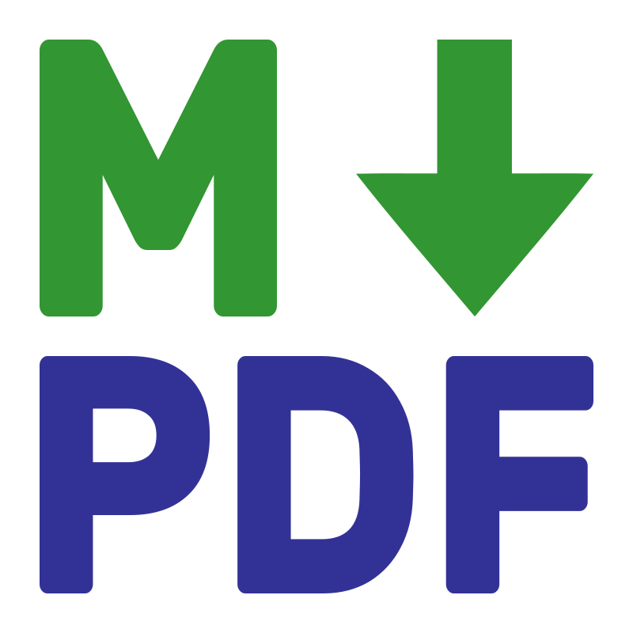
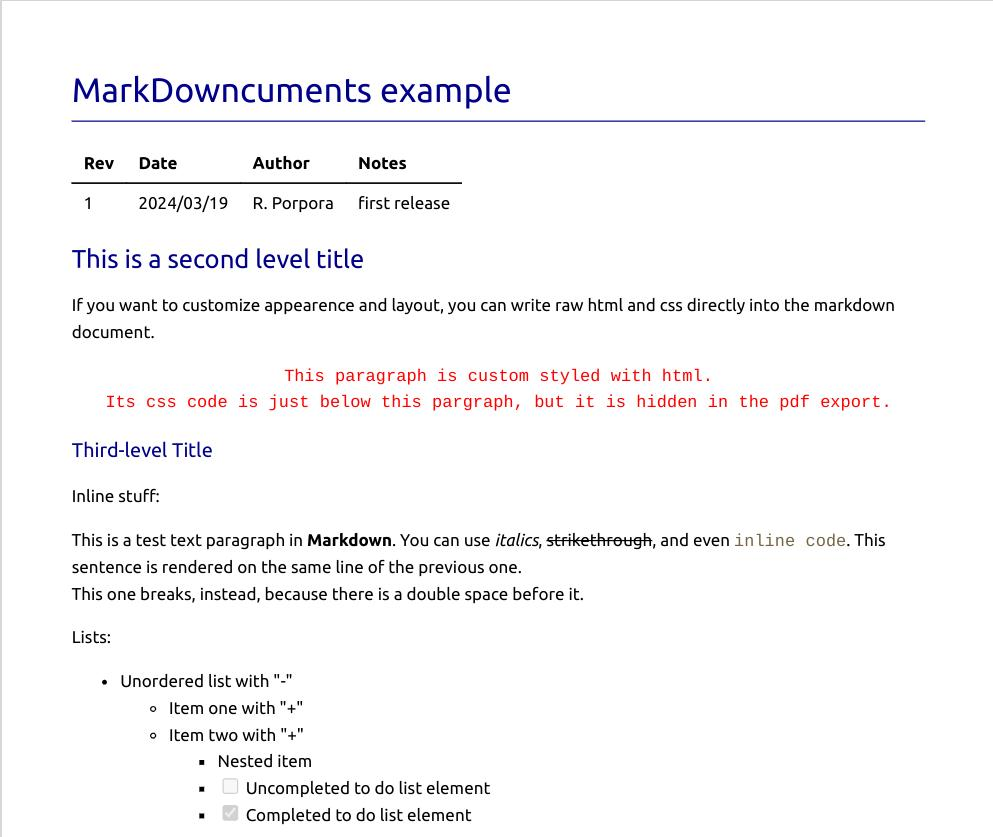

  

  <h3 align="center">MarkDowncuments</h3>

  

    📝 Markdown Documents to PDF Documents conversion tool.
     
    Runs on Windows, MacOS and Linux.
     
     
    <a href="https://github.com/RobertoPorpora/markdowncuments/issues">Report Bug</a>
    ·
    <a href="https://github.com/RobertoPorpora/markdowncuments/issues">Request Feature</a>
    ·
    <a href="https://ko-fi.com/robertoporpora">Support Project</a>
  

## About

MarkDowncuments is designed to be your go-to tool for effortlessly transforming Markdown files into beautifully formatted PDF documents.

(<a href="#readme-top">back to top</a>)

## Key Highlights

- **Ease of Use**: Just drop the executable into the directory housing your Markdown files and watch the magic unfold in a few seconds with a simple execution.
- **Batch Conversion**: MarkDowncuments effortlessly scans through all Markdown files in the folder from which it is executed, producing corresponding PDFs with ease.
- **Automatic Enhancement**: Basic styling enhancements are applied to the PDFs. Enjoy colored titles, meticulously crafted pagination, and other subtle yet impactful visual enhancements.
- **Page Breaks**: Use context breaks "***" as page breaks.
- **Versatile Functionality**: Whether you're online or offline, MarkDowncuments delivers. When connected to the web, mathematical formulas are elegantly rendered using MathJax.

(<a href="#readme-top">back to top</a>)

## Prerequisite

The system using MarkDowncuments must have **Google Chrome** or **Chromium** installed.

(<a href="#readme-top">back to top</a>)

## For Developers

- **Prerequisites**: Rust and Cargo must be installed. The build script is in Python (so you should have Python installed too...).
- **Dependencies**: 
  - anyhow
  - comrak
  - headless-chrome
- **Build Script**: The build script 'build.py' is in Python, so just run `python build.py` to build the project. The executable output directory is 'dist'.
- **Customization**: To customize the visual style, modify the HTML and CSS files located in "src/html_wrapper".

(<a href="#readme-top">back to top</a>)

## Next developments

- [ ] Options for header title and date
- [ ] Options for footer page numbering
- [ ] Output selectable between 'html', 'pdf' (should be default) or 'both' with CLI arg. Now it always creates both.
- [ ] Fix error handling, notifying the user either with an action to take or providing a message that helps understand where and why the error occurred.
- [ ] Remove dependency on the Chromium browser.
- [ ] System-wide installer: type "markdowncuments" in the terminal to execute it in the current working directory.
- [ ] Graphical interface version: opens a file browser to select what to convert.

(<a href="#readme-top">back to top</a>)

## License

Distributed under the MIT License. See `LICENSE.txt` for more information.

(<a href="#readme-top">back to top</a>)

## Acknowledgments

- [VSCode Markdown PDF by yzane](https://github.com/yzane/vscode-markdown-pdf)
- [Best README Template by othneildrew](https://github.com/othneildrew/Best-README-Template)
- [Choose an Open Source License](https://choosealicense.com)

(<a href="#readme-top">back to top</a>)

